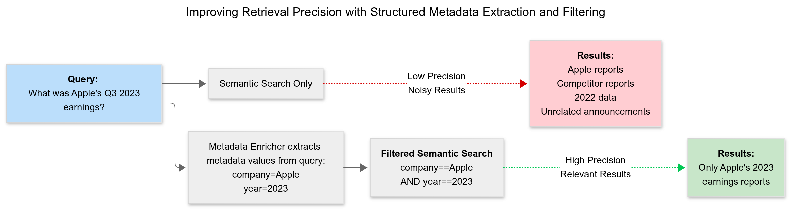
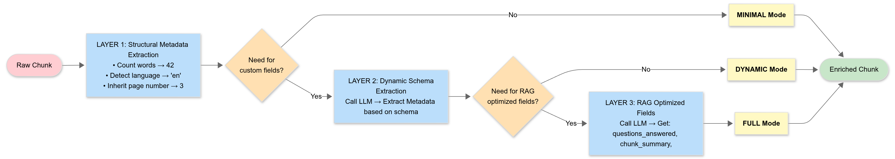
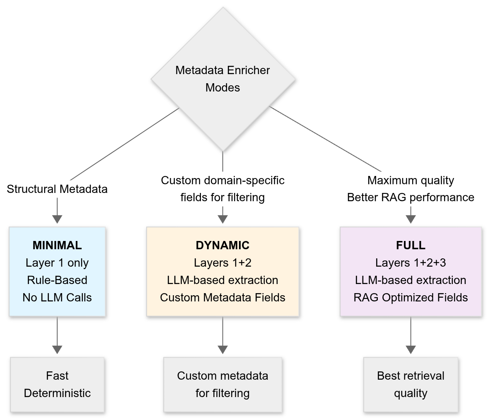

# MetadataEnricher

MetadataEnricher automatically transforms raw document chunks into richly annotated content optimized for RAG (Retrieval Augmented Generation) pipelines. It solves a fundamental problem in RAG systems: **raw documents don't have the metadata signals that modern retrieval systems need**.

When you ask a RAG system a question, it searches a vector database for relevant documents. But vector similarity alone isn't perfect—it misses nuances that metadata can capture:

- **What questions does this chunk answer?** (improves semantic match)
- **What are the key terms?** (enables supplementary lexical search)
- **Is this a definition, example, or procedure?** (helps ranking and filtering)
- **What is the company, year, or domain?** (enables semantic filtering)

MetadataEnricher automatically extracts all this metadata during document indexing, enabling your RAG system to search smarter using a three-layer enrichment strategy:

- Structural (rule-based)
- Dynamic (user-defined)
- Fixed (RAG-optimized)

## The Problem



Consider this scenario:

**Query:** "Apple's earnings in 2023"

**Without MetadataEnricher:**

- Vector search finds chunks similar to "Apple earnings 2023"
- But also returns: competitor earnings reports, unrelated Apple announcements, 2022 data
- User must manually filter or read through irrelevant results

**With MetadataEnricher:**

- Extracts: company="Apple", year=2023
- Combines vector search WITH metadata filtering (company=="Apple" AND year==2023)
- Returns only relevant documents
- Filters results by `questions_answered` ("What was Apple's 2023 earnings?")
- Displays results using `header_text` ("Apple Q3 2023 Revenue Results")

This dramatically improves both **precision** (fewer wrong results) and **retrieval quality** (most relevant first).


## How It Works



<br>
Three independent enrichment layers run in sequence, each adding value at different cost/quality tradeoffs:

| Layer | Extracted Fields | Cost | Benefit | Usage |
|-------|------|------|---------|------|
| **Layer 1: Structural Metadata (Rule-Based)** | `chunk_id`, `word_count`, `language`, `page number` | Rule-Based, No LLM Calls | Deduplication, basic filtering | Always: Runs in every mode |
| **Layer 2: Dynamic Schema (User-Defined Fields)** | Your custom fields (`company`, `year`, `category`, etc.) | Single LLM call | Domain-specific filtering and metadata | When you need custom fields |
| **Layer 3: Fixed Schema (RAG-Optimized Fields)** | `questions_answered`, `summary`, `keywords`, `content_type` | Multiple LLM calls | Semantic reranking, improved retrieval quality | For maximum RAG quality (indexing time only) |

### Layer 1: Structural (Always Runs)

Fast rule-based extraction with zero LLM cost.

| Field | Type | Example | Purpose |
|-------|------|---------|---------|
| `chunk_id` | str | `chunk_a1b2c3d4` | Unique chunk identifier |
| `content_hash` | str | `5d41402abc...` | MD5 hash for duplicate detection |
| `word_count` | int | `42` | Word count for length filtering |
| `char_count` | int | `247` | Character count |
| `language` | str | `en`, `es`, `zh` | Detected language (ISO 639-1) |
| `page_number` | int | `3` | Source page number (inherited from doc context) |
| `section_title` | str | `Introduction` | Section heading (inherited) |
| `heading_hierarchy` | str | `["Ch 1", "1.1"]` | JSON array of heading path |

### Layer 2: Dynamic Schema (User-Defined, LLM-Powered)

Extract custom fields matching your domain via structured LLM calls. Define a JSON schema; the enricher automatically extracts those fields.

Example schema:

```python
schema = {
    "properties": {
        "company": {"type": "string"},
        "fiscal_year": {"type": "integer"},
        "report_type": {"enum": ["quarterly", "annual"]}
    }
}
```

Result from text "Apple Inc. reported Q3 2023 earnings...":

```python
{
    "company": "Apple Inc.",
    "fiscal_year": 2023,
    "report_type": "quarterly"
}
```

### Layer 3: Fixed Schema (RAG-Optimized, LLM-Powered)

Automatically extract fields designed to improve RAG quality:

| Field | Type | Description |
|-------|------|-------------|
| `questions_answered` | str | 2-3 natural questions this chunk answers |
| `chunk_summary` | str | 1-2 sentence summary of content |
| `keywords` | str | 3-7 important terms |
| `content_type` | str | Classification: definition, example, procedure, conceptual, numerical, analytical, comparative |
| `header_text` | str | Descriptive title (2-8 words) |

Enables semantic reranking and better results without additional schema definition.

## Enrichment Modes



<br>
Think of enrichment modes as different "quality settings" for document preparation. Choose a mode based on your cost/quality tradeoff:

- `minimal`: Fast, no AI cost, deterministic
- `dynamic`: Custom metadata for filtering
- `full`: Best retrieval quality

## Caching

MetadataEnricher uses multi-level TTL caches to avoid redundant enrichment:

- **Module-level cache** (_chunk_cache): 1000 entries, 1 hour TTL. Deduplicates identical chunk+schema+context combinations
- **Per-layer caches**: Independent caches for each enrichment layer
  - Structural: 5000 entries, 24 hour TTL
  - Dynamic: 2000 entries, 1 hour TTL
  - Fixed: 2000 entries, 1 hour TTL

**Benefit:** Re-indexing the same corpus is ~100x faster (99% cache hits).

## Error Handling

All enrichment layers degrade gracefully. If an LLM call fails or returns invalid data:

- The layer returns an empty dict
- Other layers continue normally
- Pipeline never fails due to metadata enrichment

This ensures robust indexing even when LLM services have issues.

## Usage

```python
# Define domain schema
financial_schema = {
    "properties": {
        "company": {"type": "string"},
        "fiscal_year": {"type": "integer"},
        "document_type": {"enum": ["10-K", "10-Q", "8-K"]},
        "revenue_mentioned": {"type": "boolean"}
    }
}

# Index documents with full enrichment
enricher = MetadataEnricher()
enriched = await enricher.atransform_documents(docs, financial_schema)

# At query time, extract metadata and filter
query = "Apple's Q3 2023 10-Q filing"
metadata, filter_expr = await enricher.extract_query_metadata(query, financial_schema)
# filter_expr = 'company like "%Apple%" AND fiscal_year == 2023 AND document_type == "10-Q"'
```

## Configuration

### EnrichmentConfig

**Parameters:**

- `mode`: Which layers to run (MINIMAL, DYNAMIC, or FULL)
- `batch_size`: Documents processed concurrently in `atransform_documents()`. Higher values increase parallelism but memory usage. Recommend 5-20 depending on LLM rate limits.

### EnrichmentMode

EnrichmentMode takes one of the following values:

- `minimal`: Layer 1 only
- `dynamic`: Layers 1 + 2
- `full`: All 3 layers

## Schema Definition Guide

Layer 2 schema supports standard JSON Schema types with optional descriptions and enums:

```python
schema = {
    "properties": {
        # String field with description
        "company": {
            "type": "string",
            "description": "Company or organization mentioned"
        },

        # Integer field
        "fiscal_year": {
            "type": "integer",
            "description": "Fiscal or calendar year"
        },

        # Enum field (constrains extraction to predefined values)
        "report_type": {
            "type": "string",
            "enum": ["quarterly", "annual", "special"],
            "description": "Type of financial report"
        },

        # Boolean field
        "mentions_revenue": {
            "type": "boolean",
            "description": "Does chunk discuss revenue?"
        }
    }
}
```

**Notes:**

- All fields are optional (LLM can decline extraction if not applicable)
- Descriptions improve extraction quality
- Supported types: `string`, `integer`, `number`, `boolean`
- Enum values are case-insensitive for extraction but formatted consistently
